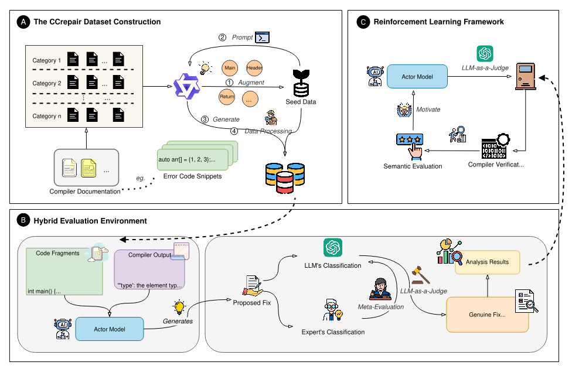

# CCrepairBench: A High-Fidelity Benchmark and Reinforcement Learning Framework for C++ Compilation Repair  

 


## 🌟 Introduction  

C++ compilation error repair is a fundamental yet challenging task in software engineering, with a direct impact on developer productivity. Traditional supervised learning approaches are limited by dataset quality and often fail to generate semantically correct fixes.  

**CCrepairBench** introduces a new paradigm, integrating a large-scale dataset, a hybrid evaluation pipeline, and a reinforcement learning (RL) framework, paving the way toward more practical and reliable automated programming assistants.  

Key contributions:  
1. **CCrepair Dataset**: The first large-scale, high-fidelity C++ compilation error dataset.  
2. **Hybrid Evaluation Environment**: Combines compiler checks with an **LLM-as-a-Judge** for semantic integrity.  
3. **Reinforcement Learning Paradigm**: Optimizes models with semantic + syntactic rewards, avoiding trivial fixes.  

## 📊 Main Contributions  

- Our RL-trained **Qwen2.5-1.5B-Instruct** achieved performance comparable to **Qwen2.5-14B**, demonstrating cross-scale effectiveness.  
- Ablation studies show that:  
  - **LLM-as-a-Judge is indispensable**; without it, models degrade into trivial code deletion strategies.  
  - The method generalizes to smaller models (e.g., 0.5B) with consistent improvements.  
- Transferability: RL-trained models also improved on **HumanEval** and **MBPP** code generation benchmarks.  

### Performance Highlights  

| Model | Genuine Fix Rate (GFR) ↑ | Compilation Success Rate (CSR) ↑ |
|-------|-------------------------|----------------------------------|
| Base Qwen2.5-1.5B | 49.9% | 63.9% |
| **Ours (RL-trained 1.5B)** | **70.8%** | **81.9%** |
| Qwen2.5-14B | 71.1% | 78.3% |

| Task | Base | RL-Trained |
|------|------|------------|
| HumanEval | 40.2% → 54.9% | **56.7% → 56.9%** |
| MBPP | 47.9% → 63.8% | **64.3% → 64.8%** |  

## 🏗️ Framework Components  

- **Dataset Construction**  
  - Seed data from Microsoft compiler documentation.  
  - LLM-based generation and verification pipeline.  
  - Cross-compiler filtering ensures generalization.  

- **Hybrid Evaluation**  
  - Stage 1: Compiler checks for syntax validity.  
  - Stage 2: **LLM-as-a-Judge** categorizes fixes as Genuine Fix / Trivial Deletion / Excessive Modification / Invalid Fix.  
  - Validated against human experts, achieving near or better agreement.  

- **Reinforcement Learning**  
  - GRPO optimization with a **gated reward formulation**.  
  - Full reward only when the fix is both semantically valid and compilable.  
  - Prevents trivial or destructive patches.  

CCrepair-Bench/
├── data/               # Dataset and related resources
├── evaluate/           # Evaluation scripts and configs
├── examples/           # Example scripts and usage cases
├── model_transfer/     # Model transfer and adaptation code
├── recipe/             # Training/evaluation recipes
├── scripts/            # Utility and helper scripts
├── tests/              # Unit tests
├── verl/               # Core source code of the framework
├── verl.egg-info/      # Package metadata
├── requirements.txt    # Dependencies
└── README.md           # Project documentation


## 🚀 Usage  

1. **Clone the repository**  
   ```bash
   git clone https://github.com/your-username/CCrepair-Bench.git
   cd CCrepair-Bench
   ```

2. **Install dependencies**  
   ```bash
   pip install -r requirements.txt
   ```

3. **Start Ray**  
   Before training, start a Ray cluster:  
   ```bash
   ray start --head --num-cpus 6
   ```

4. **Run training with CUDA**  
   Specify available GPUs and launch training with the provided script:  
   ```bash
   bash examples/grpo_trainer/run_qwen25_7b_compile.sh
   ```

5. **Monitor training with TensorBoard**  
   You can track metrics such as loss during training:  
   ```bash
   tensorboard --logdir tensorboard_log/verl_grpo_example_compile_gt/qwen2_1.5b_compile_rm_gt
   ```

6. **Convert model format for deployment**  
   To deploy with **vLLM**, convert the trained model from Verl format to Hugging Face format:  
   ```bash
   bash model_transfer/model_transfer.sh
   ```

7. **Evaluate with LLM-as-a-Judge (advanced evaluation)**  
   For semantic-level evaluation using the hybrid judge, run:  
   ```bash
   python evaluate/evaluate_llm_merged_with_LLM_as_Judge.py 
   ```


## 🤝 Citation  

If you use this work, please cite:  

```bibtex
@article{sun2026ccrepairbench,
  title={CCrepairBench: A High-Fidelity Benchmark and Reinforcement Learning Framework for C++ Compilation Repair},
  author={Sun, Weixuan and Zhai, Jucai and Zhang, Xin and Liu, Dengfeng and Wu, Xiaojun and Hao, Qiaobo and AIMgroup and Fang, Yang and Tang, Jiuyang},
  journal={AAAI Conference on Artificial Intelligence},
  year={2026}
}
```  
